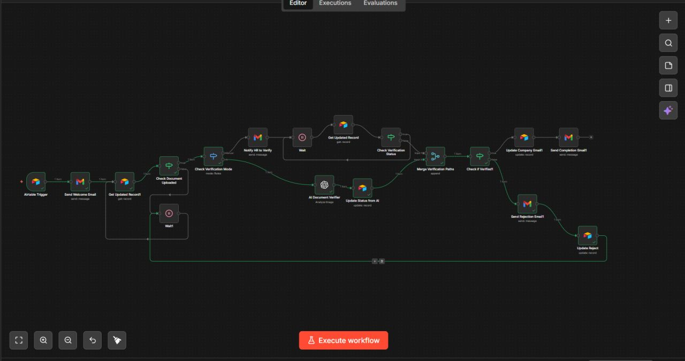

# n8n Automation

<p align="center">
  
  &nbsp;&nbsp;&nbsp;
  
  &nbsp;&nbsp;&nbsp;
  
  &nbsp;&nbsp;&nbsp;
  
</p>

<p align="center">
  <b>Employee Onboarding Automation System</b>
</p>

<p align="center">
  An automated no-code employee onboarding and document verification workflow built with n8n, Airtable, Gmail, Softr, and AI
</p>

---


## 🌐 Live Demo

[Open Live Demo](https://lakeesha80184.preview.softr.app/?autoUser=true&show-toolbar=true)

## 🔄 Automation Workflow

The workflow automates the complete document verification process, from document submission to verification, status updates, and email notifications.



## ⚙️ Workflow Overview

1. **Airtable Trigger**  
   Detects a new record submitted through the system.

2. **Welcome Email**  
   Sends an automated confirmation email to the user.

3. **Document Verification Mode**  
   Checks whether the submitted document requires verification.

4. **Verification Process**
   - Automatic AI-based document verification
   - Manual verification when required
   - Verification status tracking

5. **AI Document Verification**  
   Uses AI to analyze and verify the submitted document.

6. **Status Update**  
   Updates the Airtable record based on the verification result.

7. **Verification Decision**
   - Verified → Company email is updated and confirmation email is sent.
   - Rejected → Rejection email is sent and the record is updated.

## 🛠️ Technologies Used

| Technology | Purpose |
|---|---|
| **n8n** | Workflow automation |
| **Airtable** | Data storage and record management |
| **Gmail** | Automated email notifications |
| **AI** | Document verification |
| **Softr** | User-facing web application |

## ✨ Key Features

- 🔄 End-to-end workflow automation
- 📄 Automated document verification
- 🤖 AI-assisted verification
- 📊 Airtable-based record management
- 📧 Automated email notifications
- ✅ Verification status tracking
- ❌ Automated rejection handling
- 🌐 Web-based user interface

## 🏗️ Workflow Architecture

```text
User
  │
  ▼
Softr Application
  │
  ▼
Airtable
  │
  ▼
n8n Automation
  │
  ├── Welcome Email
  │
  ├── Document Verification
  │
  ├── AI Verification
  │
  ├── Update Status
  │
  └── Verification Decision
          │
       ┌──┴───┐
       ▼      ▼
    Verified Rejected
       │      │
       ▼      ▼
   Company   Rejection
    Email      Email
```


📌 Purpose

The project demonstrates how no-code/low-code automation can be used to create an end-to-end document verification system while reducing repetitive manual tasks and improving workflow efficiency.

🚀 Future Scope
Advanced document classification
Improved AI verification
Multilingual document support
WhatsApp/SMS notifications
Advanced analytics dashboard
More automated validation rules
Human-in-the-loop verification
